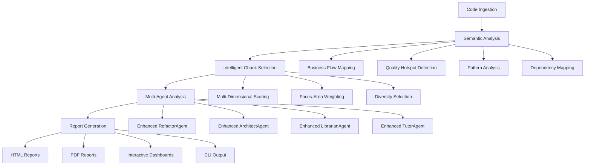

# 🤖 Strategic Code Companion

**Your AI-powered strategic partner for comprehensive code analysis and intelligent development insights.**

Strategic Code Companion is a revolutionary VS Code extension and CLI tool that provides **semantic-aware multi-agent AI analysis** to help developers make strategic decisions about their codebase. Featuring advanced code understanding, intelligent chunk selection, and context-aware recommendations - get the most relevant and actionable insights powered by next-generation AI.

## 🚀 **Revolutionary AI-Powered Analysis Engine**

Strategic Code Companion now features a **semantic-aware analysis engine** that understands your code at a deeper level than ever before. Unlike traditional static analysis tools, our system:

- **🧠 Understands Code Context**: Semantic analysis of business flows, architectural patterns, and cross-cutting concerns
- **🎯 Intelligent Prioritization**: Smart chunk selection that focuses on the most critical code for each analysis type
- **📊 Multi-Dimensional Scoring**: Evaluates code based on complexity, business relevance, and architectural importance
- **🔄 Context-Aware Suggestions**: Recommendations tailored to your specific codebase and business domains
- **📈 Quality Hotspot Detection**: Automatically identifies problem areas requiring immediate attention

## ✨ Key Features

### 🔍 **Enhanced Multi-Agent Code Analysis**

#### **🧠 Semantic Code Analyzer**
- **Business Flow Analysis**: Maps user workflows and critical business processes
- **Dependency Graph Generation**: Visualizes module relationships and circular dependencies
- **Architectural Pattern Detection**: Identifies design patterns and their implementation quality
- **Quality Hotspot Identification**: Pinpoints high-risk areas needing immediate attention
- **Cross-Cutting Concern Analysis**: Evaluates consistency of logging, error handling, security

#### **🎯 Intelligent Agent Orchestration**
- **Enhanced RefactorAgent**: Context-aware suggestions based on semantic analysis and business impact
- **Enhanced ArchitectAgent**: Pattern-aware architectural recommendations with violation detection
- **Enhanced LibrarianAgent**: Business-domain focused library recommendations
- **Enhanced TutorAgent**: Quality-driven learning resource suggestions
- **Strategic Business Agents**: Competitive analysis and market intelligence (with Composio integration)

#### **🎯 Intelligent Chunk Selection System**
- **Multi-Dimensional Scoring**: Complexity, business relevance, architectural importance, quality indicators
- **Focus-Area Optimization**: Tailored chunk selection for architecture vs business-logic vs quality analysis  
- **Diversity Algorithms**: Ensures comprehensive coverage without redundant analysis
- **Context-Aware Prioritization**: Prioritizes critical business areas and quality hotspots

### 🖥️ VS Code Extension

- **Professional UI**: Beautiful, responsive interface with tabbed results
- **GitHub Integration**: Analyze any GitHub repository directly from VS Code
- **Interactive Visualizations**: Dependency graphs, metrics dashboards, and more
- **Export Reports**: Generate HTML, PDF, Markdown, or JSON reports
- **Command Palette Integration**: Access all features via VS Code commands

### 🚀 CLI Tool

- **Standalone Analysis**: Run comprehensive code analysis from command line
- **Multiple Output Formats**: JSON, Markdown, HTML, PDF reports
- **Configuration Management**: Secure API key storage and settings
- **Progress Indicators**: Visual feedback for long-running analyses
- **Cross-platform**: Works on Windows, macOS, and Linux

### 📊 Enhanced Visualizations

- **Dependency Graph**: Interactive network visualization of code dependencies
- **Circular Dependency Detection**: Identify and fix architectural issues
- **Metrics Dashboard**: Visual representation of code quality metrics
- **Hotspot Analysis**: Identify problematic areas in your codebase

### 🐙 GitHub Integration

- **Repository Analysis**: Analyze any public or private GitHub repository
- **Search & Discovery**: Find and analyze repositories based on your criteria
- **Session Management**: Track and manage analysis sessions
- **Export Results**: Generate reports directly from GitHub analysis

## Installation & Setup

1. **Install Dependencies**:

   ```bash
   npm install
   ```

2. **Compile TypeScript**:

   ```bash
   npm run compile
   ```

3. **Run Extension**:
   - Open the project in VS Code
   - Press `F5` to launch Extension Development Host
   - In the new VS Code window, click the Strategic Code Companion icon in the Activity Bar

## First Time Setup

1. **Configure AI Provider**:

   - Click the Strategic Code Companion icon in the Activity Bar
   - Select your preferred LLM provider (Gemini/Claude/OpenAI)
   - Enter your API key (stored securely using OS keychain)

2. **Analyze Your Code**:
   - Open any workspace with code files
   - Click "Analyze Workspace" button
   - Wait for the multi-agent analysis to complete
   - Explore results in the tabbed interface

## 🎯 **How the Enhanced Analysis Engine Works**

### **Phase 1: Semantic Code Understanding**
```
🧠 Semantic Analyzer
├── Business Flow Mapping → Identifies user workflows and critical processes
├── Dependency Analysis → Maps module relationships and circular dependencies  
├── Pattern Detection → Recognizes architectural patterns and violations
├── Quality Assessment → Identifies hotspots requiring immediate attention
└── Cross-Cutting Analysis → Evaluates logging, security, error handling consistency
```

### **Phase 2: Intelligent Code Selection**
```
🎯 Smart Chunk Selector
├── Multi-Dimensional Scoring
│   ├── Complexity Score (cyclomatic complexity, nesting depth)
│   ├── Business Relevance (domain terms, critical paths)
│   ├── Architectural Importance (patterns, interfaces, boundaries)
│   └── Quality Indicators (code smells, technical debt)
├── Focus-Area Weighting (architecture vs business-logic vs quality)
├── Diversity Selection (avoid redundant similar code)
└── Context Prioritization (critical business areas first)
```

### **Phase 3: Context-Aware Agent Analysis**
```
🤖 Enhanced Multi-Agent System
├── Enhanced RefactorAgent
│   ├── Quality hotspot-driven suggestions
│   ├── Business impact prioritization
│   └── Architectural pattern-aware fixes
├── Enhanced ArchitectAgent  
│   ├── Pattern violation detection
│   └── Semantic context integration
├── Enhanced LibrarianAgent
│   ├── Business domain matching
│   └── Gap-driven recommendations
└── Enhanced TutorAgent
    ├── Quality issue-focused learning
    └── Skill gap identification
```

## 🔍 **Enhanced Analysis Results**

### **1. Semantic Overview**
- **Business Flow Maps**: Visual representation of critical user workflows
- **Quality Hotspot Dashboard**: Risk-scored problem areas with business impact
- **Architectural Pattern Adherence**: Pattern implementation quality scores
- **Dependency Health**: Circular dependency detection and coupling metrics

### **2. Context-Aware Refactoring**
- **Prioritized by Business Impact**: Critical business logic fixes first
- **Quality Hotspot Integration**: Suggestions based on real identified issues
- **Pattern-Aware Fixes**: Refactoring that maintains architectural integrity
- **Before/After with Context**: Code examples showing real problems from your codebase

### **3. Intelligent Architecture Suggestions**  
- **Pattern Violation Fixes**: Specific improvements for detected anti-patterns
- **Business Domain Alignment**: Architecture suggestions aligned with business needs
- **Quality-Driven Enhancements**: Improvements targeting identified hotspots
- **Implementation Roadmaps**: Step-by-step guides with effort estimation

### **4. Business-Focused Libraries**
- **Domain-Specific Matching**: Libraries matched to your business domains
- **Gap-Driven Recommendations**: Libraries addressing identified functionality gaps
- **Quality Integration**: Libraries that help fix identified quality issues
- **Business Context**: Relevance explained in terms of your specific domains

### **5. Quality-Driven Learning Resources**
- **Skill Gap Analysis**: Learning resources based on identified quality issues
- **Priority-Ordered Topics**: Tutorials addressing your most critical needs
- **Context-Aware Filtering**: Resources filtered by your tech stack and patterns
- **Implementation-Focused**: Learning materials with direct application to your code

## 🏗️ **Enhanced Architecture**

### **Complete Project Structure**
```
src/
├── extension.ts                    # Main activation & integration
├── cli/                           # 🚀 CLI Tool
│   ├── index.ts                   # CLI entry point with commands
│   ├── CLIAnalysisEngine.ts       # Standalone analysis engine
│   ├── CLIConfig.ts              # Configuration management
│   └── ProgressIndicator.ts      # Visual progress feedback
├── github/                        # 🐙 GitHub Integration
│   ├── GitHubIntegration.ts       # Repository analysis & cloning
│   └── GitHubProvider.ts          # VS Code tree provider & commands
├── reports/                       # 📊 Professional Report Generation
│   ├── ReportGenerator.ts         # Main report orchestrator
│   ├── MarkdownReportGenerator.ts # Markdown reports with charts
│   ├── HTMLReportGenerator.ts     # Interactive HTML reports  
│   └── PDFReportGenerator.ts      # Professional PDF generation
├── visualizations/                # 📈 Interactive Visualizations
│   └── DependencyGraphProvider.ts # D3.js dependency graphs
├── agents/                        # 🤖 Enhanced Multi-Agent System
│   ├── main.ts                    # Original orchestrator (maintained)
│   ├── RefactorAgent.ts           # Basic refactor agent (maintained)
│   ├── ArchitectAgent.ts          # Basic architect agent (maintained)
│   ├── LibrarianAgent.ts          # Enhanced library agent  
│   ├── TutorAgent.ts              # Basic tutor agent (maintained)
│   └── enhanced/                  # 🧠 NEW: Advanced AI Agents
│       ├── SemanticCodeAnalyzer.ts        # Deep code understanding
│       ├── IntelligentChunkSelector.ts    # Smart code prioritization
│       ├── EnhancedRefactorAgent.ts       # Context-aware refactoring
│       └── EnhancedMultiAgentOrchestrator.ts # Semantic-aware orchestration
├── services/                      # 🔧 Core Services
│   ├── OpenAIAgentOrchestrator.ts # Strategic business analysis
│   ├── RAGImplementationService.ts # RAG pipeline implementation
│   └── YouTubeSearchService.ts    # Tutorial discovery
├── utils/                         # 🛠️ Enhanced Utilities
│   └── RAGContextBuilder.ts       # Intelligent context building
├── security/
│   └── keyManager.ts             # Secure API key storage
├── llm/                          # Multi-provider LLM support
├── rag/                          # Code analysis pipeline
└── sidebar/                      # Modern Webview UI
```

### **🧠 Enhanced Analysis Flow**



### **🎯 Analysis Strategy Selection**

The system now intelligently adapts its analysis based on codebase characteristics:

| Codebase Type | Focus Areas | Chunk Selection | Agent Weighting |
|---------------|-------------|-----------------|-----------------|
| **Enterprise Apps** | Business Logic + Architecture | Domain-driven selection | RefactorAgent (High), ArchitectAgent (High) |
| **Libraries/SDKs** | API Design + Performance | Interface-focused selection | ArchitectAgent (High), LibrarianAgent (Medium) |  
| **Startups** | Quality + Technical Debt | Hotspot-driven selection | RefactorAgent (High), TutorAgent (Medium) |
| **Legacy Systems** | Architecture + Dependencies | Risk-focused selection | ArchitectAgent (High), RefactorAgent (High) |
| **Microservices** | Integration + Patterns | Service-boundary selection | ArchitectAgent (High), LibrarianAgent (Medium) |

## Security

- API keys are stored using VS Code's SecretStorage API
- Keys are encrypted using the operating system's native keychain
- No sensitive data is stored in plain text or configuration files

## 📦 **Enhanced Dependencies & Tech Stack**

### **Core Framework**
- **TypeScript 4.9+**: Full type safety with advanced generics
- **VS Code Extension API**: Rich integration with editor features
- **Node.js 18+**: Modern runtime with ESM support

### **AI & Analysis Engine**
- **Multi-Provider LLM Support**: 
  - Google Gemini (recommended for speed/cost)
  - Anthropic Claude (best for complex analysis)
  - OpenAI GPT (general purpose analysis)
- **Advanced Code Analysis**:
  - Babel Parser for AST processing
  - Custom semantic analyzers
  - Intelligent chunk selection algorithms
  - Multi-dimensional code scoring

### **CLI & Reporting**
- **Commander.js**: Sophisticated command-line interface
- **Puppeteer**: High-quality PDF generation
- **D3.js**: Interactive dependency visualizations  
- **Chart.js**: Metrics dashboards and quality charts

### **GitHub & External Integration**
- **Octokit**: Complete GitHub API integration
- **Composio SDK**: Strategic business intelligence
- **Axios**: HTTP client for external services

### **UI & Visualization**
- **Custom Webview**: Modern CSS with VS Code theming
- **Interactive Charts**: D3.js network graphs
- **Professional Reports**: HTML/CSS with print optimization
- **Responsive Design**: Adapts to different screen sizes

## 🛠️ **Development & Usage Guide**

### **Quick Start - VS Code Extension**
```bash
# Install dependencies
npm install

# Compile TypeScript
npm run compile

# Launch extension development host
# Press F5 in VS Code, or:
npm run watch  # for continuous compilation
```

### **CLI Tool Development**
```bash
# Build CLI tool
npm run build:cli

# Test CLI locally
npm run test:cli

# Install globally for testing
npm install -g .
strategic-code-companion --help
```

### **Enhanced Analysis Usage**

#### **For VS Code Extension:**
```typescript
// Use enhanced analysis (recommended)
const enhancedOrchestrator = new EnhancedMultiAgentOrchestrator(llmProvider, composioKey);
const results = await enhancedOrchestrator.analyzeCodebase(chunks, true);

// Results now include semantic insights:
console.log(results.semanticContext.qualityHotspots);
console.log(results.enhancedInsights.businessLogicAreas);
```

#### **For CLI Tool:**
```bash
# Enhanced analysis with semantic understanding
strategic-code-companion analyze ./project --provider gemini --key YOUR_KEY

# GitHub repository analysis
strategic-code-companion analyze https://github.com/user/repo --output html

# Focus on specific analysis type
strategic-code-companion analyze ./project --focus architecture --output pdf

# Batch analysis with custom configuration
strategic-code-companion analyze ./project --config ./analysis-config.json
```

### **Configuration Options**
```json
{
  "provider": "gemini|claude|openai",
  "analysisDepth": "basic|standard|comprehensive", 
  "focusAreas": ["architecture", "business-logic", "quality"],
  "chunkSelection": {
    "maxChunks": 50,
    "diversityWeight": 0.3,
    "includeContext": true
  },
  "semanticAnalysis": {
    "enableBusinessFlowMapping": true,
    "enableQualityHotspotDetection": true,
    "enablePatternAnalysis": true
  }
}
```

## Requirements

- VS Code 1.74.0 or higher
- Node.js 18.x or higher
- API key from one of the supported providers

## 💎 **Enhanced Language Support & Analysis Capabilities**

### **Tier 1: Full Semantic Analysis**
- **JavaScript/TypeScript**: Complete AST analysis, pattern detection, business flow mapping
- **React/Next.js Projects**: Component analysis, hook patterns, performance optimization
- **Node.js Applications**: API pattern analysis, middleware detection, error handling

### **Tier 2: Advanced Pattern Recognition**  
- **Python**: Function/class analysis, import dependency mapping, framework detection
- **Java**: OOP pattern analysis, Spring Boot integration, architecture evaluation
- **C#/.NET**: SOLID principle analysis, design pattern detection, dependency injection

### **Tier 3: Structure-Aware Analysis**
- **Go**: Package analysis, interface patterns, concurrency evaluation
- **Rust**: Ownership pattern analysis, trait usage, performance optimization
- **PHP**: Framework detection (Laravel/Symfony), OOP pattern analysis

### **Universal Analysis Features**
- **Quality Hotspot Detection**: Works across all languages
- **Complexity Scoring**: Language-agnostic complexity metrics
- **Dependency Analysis**: Import/include pattern analysis
- **Documentation Analysis**: Comment quality and coverage assessment
- **Security Pattern Detection**: Common vulnerability patterns

## 🚨 **Troubleshooting & Advanced Features**

### **Common Issues & Solutions**

#### **API Key Configuration**
```bash
# VS Code Extension
1. Use "Clear API Key" button and reconfigure
2. Check VS Code Developer Console for errors
3. Verify provider-specific API key format

# CLI Tool  
strategic-code-companion config --show  # Check current config
strategic-code-companion config --provider gemini --key YOUR_NEW_KEY
```

#### **Analysis Performance**
```bash
# Large codebases - optimize chunk selection
strategic-code-companion analyze ./project --max-chunks 30 --focus quality

# Memory issues - reduce analysis scope
strategic-code-companion analyze ./project --analysis-depth basic
```

#### **GitHub Integration Issues**
```bash
# Authentication issues
strategic-code-companion config --github-token YOUR_GITHUB_TOKEN

# Repository access issues  
strategic-code-companion analyze https://github.com/user/repo --clone-depth 1
```

### **Advanced Usage Examples**

#### **Enterprise Codebase Analysis**
```bash
# Comprehensive analysis with business focus
strategic-code-companion analyze ./enterprise-app \
  --provider claude \
  --analysis-depth comprehensive \
  --focus business-logic \
  --output html \
  --file enterprise-analysis.html \
  --enable-semantic-analysis
```

#### **Library/SDK Analysis** 
```bash
# API-focused analysis
strategic-code-companion analyze ./my-sdk \
  --focus architecture \
  --max-chunks 25 \
  --diversity-weight 0.4 \
  --output pdf \
  --file sdk-architecture-report.pdf
```

#### **Quality Audit**
```bash
# Quality-focused analysis with hotspot detection
strategic-code-companion analyze ./legacy-code \
  --focus quality \
  --enable-hotspot-detection \
  --output markdown \
  --file quality-audit.md
```

## 🎯 **Complete CLI Reference**

### **Core Commands**
```bash
strategic-code-companion analyze <path|url>     # Analyze code or GitHub repo
strategic-code-companion config [options]      # Configure settings
strategic-code-companion report <file>         # Generate report from JSON results
strategic-code-companion --help               # Show all commands
```

### **Analysis Options**
```bash
--provider <gemini|claude|openai>    # AI provider selection
--key <api-key>                      # API key override
--composio <composio-key>           # Enhanced analysis key
--output <json|markdown|html|pdf>   # Report format
--file <filename>                   # Output file path
--config <config-path>              # Custom configuration
--verbose                          # Detailed logging
--no-enhanced                      # Disable advanced features
```

### **Advanced Analysis Options**
```bash
--analysis-depth <basic|standard|comprehensive>
--focus <architecture|business-logic|quality|performance|security>
--max-chunks <number>              # Limit code chunks analyzed
--diversity-weight <0.0-1.0>       # Chunk selection diversity
--enable-semantic-analysis         # Deep code understanding
--enable-hotspot-detection         # Quality problem identification
--enable-business-flow-mapping     # User workflow analysis
```

### **Configuration Management**
```bash
strategic-code-companion config --provider gemini --key YOUR_KEY
strategic-code-companion config --composio YOUR_COMPOSIO_KEY  
strategic-code-companion config --github-token YOUR_GITHUB_TOKEN
strategic-code-companion config --default-format html
strategic-code-companion config --show                    # View settings
```

### **Batch Analysis Examples**
```bash
# Analyze multiple projects
for dir in project1 project2 project3; do
  strategic-code-companion analyze ./$dir --output json --file ${dir}-analysis.json
done

# Generate combined report
strategic-code-companion report project1-analysis.json --output html --file combined-report.html
```

---

## 🌟 **What's New in Enhanced Version**

### **🧠 Revolutionary AI Understanding**
- **Semantic Code Analysis**: Deep understanding of business flows and architectural patterns
- **Intelligent Prioritization**: Smart selection of the most relevant code for analysis
- **Context-Aware Suggestions**: Recommendations tailored to your specific business domains
- **Quality Hotspot Detection**: Automated identification of high-risk problem areas

### **🚀 Professional Tooling**
- **Standalone CLI Tool**: Complete command-line interface with progress indicators
- **GitHub Integration**: Direct repository analysis with session management
- **Professional Reports**: HTML, PDF, Markdown with interactive charts and visualizations
- **Interactive Visualizations**: D3.js dependency graphs with circular dependency detection

### **📊 Business Intelligence**
- **Strategic Insights**: Competitive analysis and market positioning (with Composio)
- **Business Domain Mapping**: Understanding of critical business logic areas
- **ROI-Focused Recommendations**: Prioritized by business impact and implementation effort
- **Executive Reporting**: Business-ready summaries for stakeholders

---

**Built with ❤️ for developers who demand intelligent, context-aware code analysis.**

*Strategic Code Companion - The most advanced AI-powered code analysis platform for modern development teams.*
